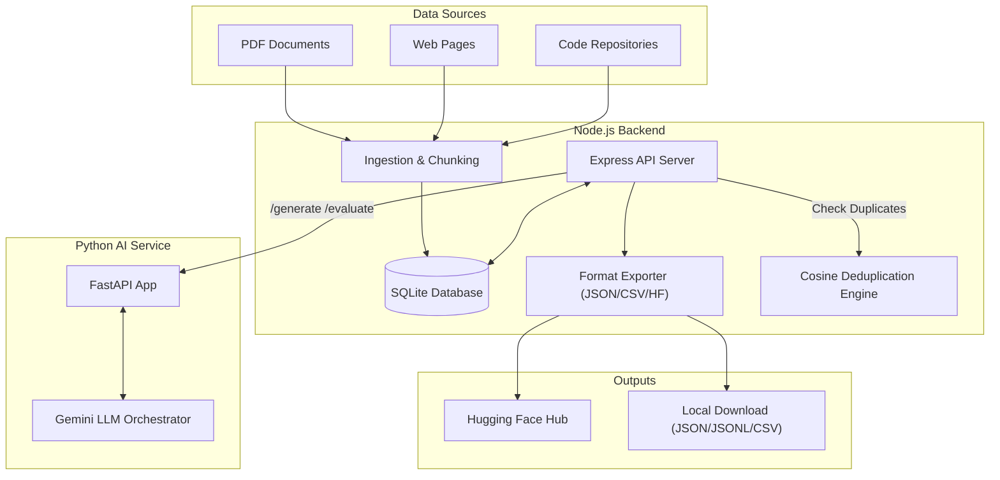

# Synthetic Instruction Dataset Generator (SIDG)

SIDG is an enterprise-grade platform designed to automatically ingest documents, websites, and codebases, extract and chunk text content, and generate high-quality, validated, and curated instruction-tuning datasets for Large Language Models (LLMs).

The platform supports Supervised Fine-Tuning (SFT), Chain-of-Thought (CoT) reasoning, programming instructions, preference alignment (DPO/RLHF), function calling, and multilingual dataset generation. It features built-in quality evaluation, semantic duplicate detection, benchmark contamination checks, manual human review workflows, dataset versioning, and direct export capabilities to the Hugging Face Hub.

---

## Key Features

- **Multi-Source Data Ingestion:** Seamlessly ingest and parse content from PDF manuals, live websites, repository files, or plain text uploads.
- **Advanced Text Chunking:** Smart text chunking with overlap that respects sentence and paragraph boundaries to prevent context fragmentation.
- **Diverse Dataset Categories:** Generate tailored datasets for SFT, reasoning traces, function calling/tool use, coding tasks, and preference pairs (Chosen vs. Rejected).
- **Multilingual Support:** Generate instruction pairs natively in English, Hindi, Tamil, Telugu, Marathi, and Bengali.
- **Automated Quality Engine:** Programmatically assess sample quality (scoring 0–100) across metrics like grammar, toxicity, hallucination, and factual consistency using Gemini models.
- **Contamination & Deduplication:** Avoid data contamination against common benchmarks (GSM8K, MMLU, HumanEval, ARC, TruthfulQA) and clean datasets of semantic duplicates using Word Frequency Cosine Similarity.
- **Human-in-the-Loop Review:** An intuitive web interface supporting acceptance, rejection, edit, flag, and bulk actions for annotations.
- **Dataset Versioning & Release:** Snapshot versioning (e.g., v1.0.0) recording sample counts, change logs, and average quality scores.
- **Hugging Face Hub Integration:** One-click dataset export to JSON, JSONL, or CSV formats, or push directly to the Hugging Face Hub as a `DatasetDict`.

---

## Technology Stack

### Frontend
- **Framework:** React 19 + TypeScript
- **Bundler:** Vite 8
- **Styling:** Tailwind CSS 4
- **Icons:** Lucide React
- **Data Visualization:** Recharts

### Backend
- **Runtime:** Node.js (v20+)
- **Server Framework:** Express + TypeScript
- **Database:** SQLite (`sqlite3` wrapper)
- **Utilities:** Cheerio (Web Scraping), pdf-parse (PDF extraction), Axios (HTTP requests), Multer (file upload parsing)

### AI Service (Python)
- **Framework:** FastAPI + Uvicorn
- **SDK:** Google Generative AI (`google-generativeai`)
- **LLM Model:** Gemini 1.5 Flash (fallback to FreeModel API proxy or mocks for offline setup)
- **Validation:** Pydantic (data parsing & schemas)

---

## System Architecture



---

## Project Structure

```text
Synthetic_Instruction_Dataset_Generator/
├── backend/                  # Node.js Express API Server
│   ├── src/
│   │   ├── services/         # Ingestion, export, LLM interaction, and QA services
│   │   │   ├── export.ts
│   │   │   ├── ingest.ts
│   │   │   ├── llm.ts
│   │   │   └── quality.ts
│   │   ├── db.ts             # SQLite initialization and SQL helper utilities
│   │   ├── server.ts         # REST API server entrypoint
│   │   └── test_db_import.ts
│   ├── package.json
│   ├── tsconfig.json
│   └── test_db.js
├── frontend/                 # Vite + React UI Console
│   ├── src/
│   │   ├── assets/           # Images and SVG icons
│   │   ├── components/       # Interface sections (Dashboard, Review, Export, etc.)
│   │   ├── App.tsx           # React app shell and sidebar navigation
│   │   ├── index.css         # Custom animations and dark-mode styles
│   │   └── main.tsx          # Client entrypoint
│   ├── package.json
│   └── vite.config.ts
├── python_service/           # FastAPI AI Service
│   ├── main.py               # API endpoints & mock model fallback logic
│   ├── requirements.txt
│   └── test_freemodel.py     # FreeModel API verification script
├── prd.md                    # Core Product Requirements Document
└── README.md                 # Project Documentation
```

---

## Installation & Setup

### Prerequisites
- [Node.js](https://nodejs.org/) (v20 or higher)
- [Python](https://www.python.org/) (v3.9 or higher)
- A Gemini API Key or a FreeModel API token.

### 1. Run Python AI Service
1. Navigate to the `python_service` directory:
   ```bash
   cd python_service
   ```
2. Create and activate a virtual environment (optional but recommended):
   ```bash
   python -m venv venv
   # On Windows:
   venv\Scripts\activate
   # On macOS/Linux:
   source venv/bin/activate
   ```
3. Install dependencies:
   ```bash
   pip install -r requirements.txt
   ```
4. Create a `.env` file in the `python_service` directory and add your API key:
   ```env
   GEMINI_API_KEY="your-gemini-api-key"
   # OR use FreeModel token
   # FREEMODEL_API_KEY="fe_..."
   PORT=8000
   ```
5. Start the service:
   ```bash
   python main.py
   ```
   The Python service will run on `http://localhost:8000`.

### 2. Run Backend Server
1. Navigate to the `backend` directory:
   ```bash
   cd ../backend
   ```
2. Install dependencies:
   ```bash
   npm install
   ```
3. Start the Express server in development mode:
   ```bash
   npm run dev
   ```
   The backend API will run on `http://localhost:5001`. It will automatically initialize the local `database.sqlite` file.

### 3. Run Frontend App
1. Navigate to the `frontend` directory:
   ```bash
   cd ../frontend
   ```
2. Install dependencies:
   ```bash
   npm install
   ```
3. Start the Vite development server:
   ```bash
   npm run dev
   ```
   The web application interface will open at `http://localhost:5173`.

---

## API Documentation

### Global Stats
- **`GET /api/stats`**
  - Returns global counts for projects, chunks, sources, samples, and averages quality scores.

### Projects
- **`GET /api/projects`**: Lists all projects.
- **`POST /api/projects`**: Creates a new project workspace.
  - *Payload*: `{ "name": "Name", "description": "Desc", "category": "sft/reasoning/coding/etc", "languages": ["English", "Hindi"], "systemPrompt": "..." }`
- **`GET /api/projects/:id`**: Gets project details.
- **`DELETE /api/projects/:id`**: Deletes a project workspace and cascades deletes to all its chunks, sources, and samples.
- **`GET /api/projects/:id/stats`**: Gets specific stats (approved, duplicates, average scores) for a project.

### Ingestion & Sources
- **`GET /api/projects/:id/sources`**: Lists files/web sources ingested for a project.
- **`POST /api/projects/:id/sources`**: Ingests new content. Supports multipart/form-data upload for PDFs/files or JSON for website scraping.
  - *Fields*: `type` (`pdf`/`website`/`file`), `name`, `url` (website url), `rawText` (plain text content), `chunkSize`, `chunkOverlap`.
- **`DELETE /api/sources/:id`**: Deletes source and corresponding chunks.

### Generation Engine
- **`POST /api/projects/:id/generate`**
  - Automates generation from raw chunks. Fetches unused chunks, sends them to the Python AI service, evaluates their grammar and toxic scores, checks for contamination/duplicates, and saves samples to the DB.
  - *Payload*: `{ "limit": number_of_chunks, "category": "override_category" }`

### Dataset Export
- **`GET /api/projects/:id/export?format=json|jsonl|csv&scope=approved|all`**
  - Downloads formatted file containing generated instructions.
- **`POST /api/projects/:id/export/hf`**
  - Pushes approved samples directly to the Hugging Face Hub.
  - *Payload*: `{ "repoId": "username/dataset-name", "token": "hf_write_token", "split": "train" }`

---

## Future Enhancements
- **Self-Instruct Pipeline:** Run self-feeding instruction generators starting from seed prompts.
- **Agent Trajectory Generator:** Build datasets that model multiple agent steps and tool interactions sequentially.
- **Contamination Visualizer:** A detailed UI mapping specific sections of samples that matched benchmark subsets.
- **Dataset Flywheel:** Real-time user edits feeding back to fine-tune the local generation prompt weights.

---

## License
MIT License. Created by Mayank Tomar.
